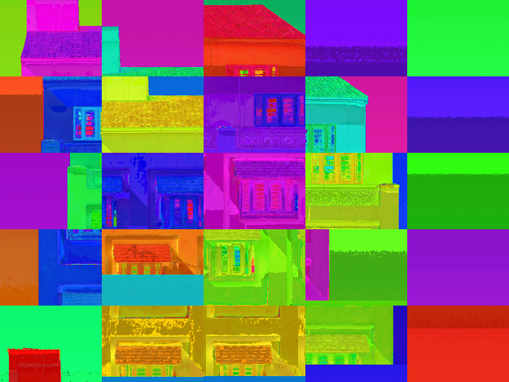

# Generative

In this repository I collect various attempts at randomly and/or automatically generating content.

## Examples

Examples from the `processing/renders` directory:

Examples from the `quil/renders` directory:

